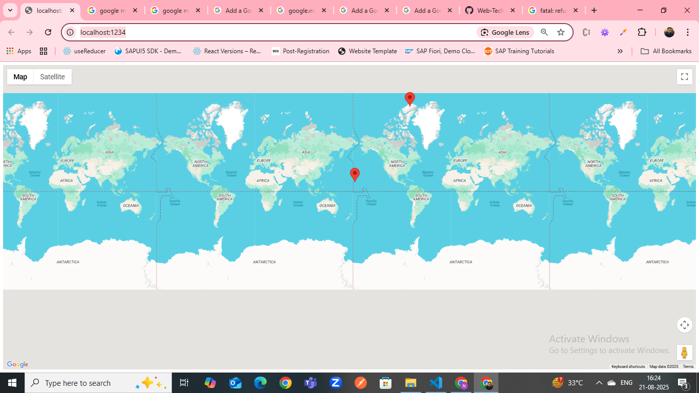

# google-map-typescript

Adding google map integration with typescript and javascript

## To run this project use below command

npx parcel index.html

## After this navigate/check below url

http://localhost:1234/

## Map will start rendering

